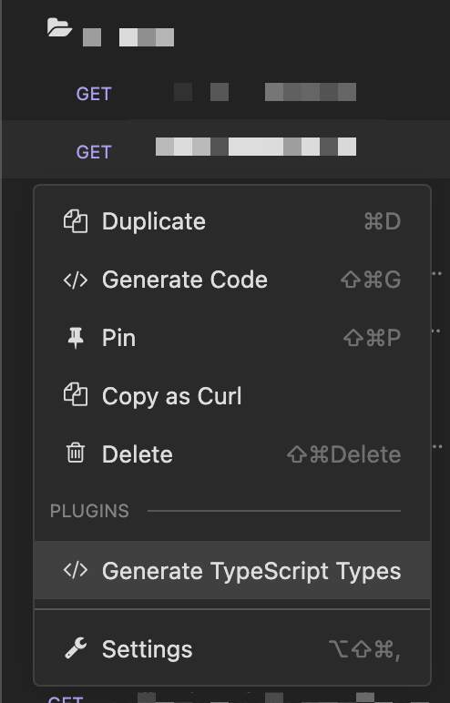

# Insomnia - Response to Typescript Types

Add a Request Action to generate TypeScript *types based on the response data.

\**the root type will be based on the filename + capitalisation*

## Install

1. Go to `Insomnia/Preferences` and choose the *Plugins* tab
2. Enter `insomnia-plugin-res2ts` and click on `Install Plugin`
3. That's it, enjoy!

## Credits
- [json-ts](https://github.com/shakyshane/json-ts)